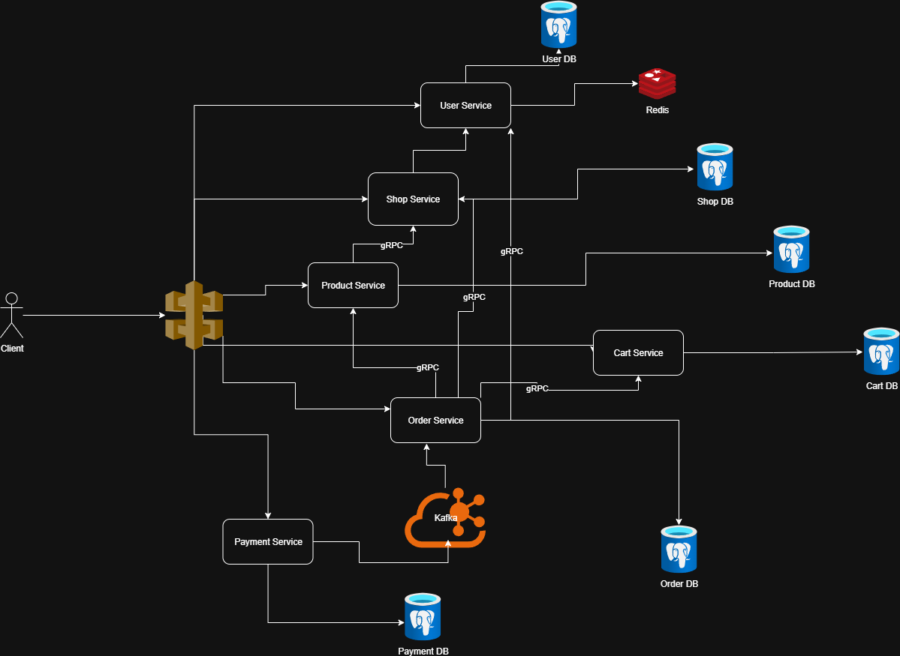

# Go-Shop — Microservices E-commerce Platform

Go-Shop is an open-source project that builds a fully functional e-commerce platform based on a microservices architecture. The entire system is developed in Go (Golang), applying modern technologies and software design patterns to ensure scalability, high performance, and maintainability.

The goal of Go-Shop goes beyond creating a real-world product — it also serves as a reference architecture for the Go developer community, providing high-quality source code and documentation for those who want to learn and implement complex microservices systems in practical environments.

## 📋 Mục lục

- [Yêu cầu chức năng](#yêu-cầu-chức-năng)
- [Thiết kế API](#thiết-kế-api)
- [Tech Stack](#tech-stack)
- [Microservices](#microservices)
- [Development](#development)
- [Deployment](#deployment)

## 🎯 Functional Requirements

- **User Management**: Auth (JWT), roles (*Seller, Customer, Shipper*), profile CRUD, multiple addresses  
- **Shop**: Shop CRUD, promotions management  
- **Product**: Product CRUD  
- **Cart**: Add/update/remove items, apply promotions, calculate total  
- **Order**: Create order from cart, view cart, manage order status  
- **Payment**: E-wallet handling, MoMo integration, payment history  

## 🔗 Thiết kế API

### Authentication APIs
```
POST   /api/v1/auth/register
POST   /api/v1/auth/login
POST   /api/v1/auth/logout
POST   /api/v1/auth/refresh
POST   /api/v1/auth/change-password
```

### User Management APIs
```
# User Profile Management
POST   /api/v1/users/profile
GET    /api/v1/users/profile
GET    /api/v1/users/{id}
PUT    /api/v1/users/profile
DELETE /api/v1/users

# Address Management
GET    /api/v1/users/addresses
POST   /api/v1/users/addresses
GET    /api/v1/users/addresses/{id}
PUT    /api/v1/users/addresses/{id}
DELETE /api/v1/users/addresses/{id}
PUT    /api/v1/users/addresses/{id}/default

# Role Management (User, Shipper)
POST   /api/v1/users/shippers/register
GET    /api/v1/users/shippers/profile
GET    /api/v1/users/shippers/{id}/profile
PUT    /api/v1/users/shippers/profile
```

### Shop Management APIs
```
GET    /api/v1/shops
POST   /api/v1/shops
GET    /api/v1/shops/{id}
PUT    /api/v1/shops/{id}
DELETE /api/v1/shops/{id}

# Promotions & Campaigns
GET    /api/v1/shops/{id}/promotions
POST   /api/v1/shops/{id}/promotions
GET    /api/v1/shops/{id}/promotions/{promo_id}
PUT    /api/v1/shops/{id}/promotions/{promo_id}
DELETE /api/v1/shops/{id}/promotions/{promo_id}
```

### Product Catalog APIs
```
GET    /api/v1/products
POST   /api/v1/products
GET    /api/v1/products/{id}
PUT    /api/v1/products/{id}
DELETE /api/v1/products/{id}
```

### Cart APIs
```
GET    /api/v1/cart
DELETE /api/v1/cart
POST   /api/v1/cart/items
```

### Order Management APIs
```
POST   /api/v1/orders
GET    /api/v1/orders
GET    /api/v1/orders/{id}
```

### Payment APIs
```
POST   /api/v1/payments/initiate
POST   /api/v1/payments/ipn/:provider
POST   /api/v1/payments/refund
```

## 🛠️ Tech Stack

### 📦 Backend
- **Language**: Go (Golang) `1.24+`  
- **Frameworks**: Gin (HTTP), gRPC (inter-service communication)  
- **Database**: PostgreSQL (primary storage), Redis (cache & rate limiting)  
- **Message Broker**: Apache Kafka (event-driven architecture)  
- **Authentication**: JWT (JSON Web Tokens)  

### 🏗 Infrastructure
- **Containerization**: Docker, Docker Compose  
- **API Gateway**: Kong (routing)  
- **Monitoring & Tracing**: Jaeger (distributed tracing)  
- **CI/CD**: GitHub Actions  

### 🧰 Development Tools
- **Package Management**: Go Modules, Go Workspaces  
- **Testing**: Testify (assertions), GoMock (mock objects)  
- **Code Quality**: golangci-lint
- **Load Testing**: k6 (performance and load testing)

### 🗄 Data Management
- **Database per Service**: Each microservice owns its own PostgreSQL database  
- **Event-Driven Architecture**: Async communication via Kafka with **Inbox/Outbox Pattern**  
- **Saga Pattern**: Distributed transaction management (e.g., Order → Product → Payment)  
- **Data Consistency**: Achieved through eventual consistency  

### 🔐 Security & Cross-cutting Concerns
- **API Gateway**: Kong as unified entry point for all requests  
- **Authentication**: JWT, user context propagated via headers  
- **Authorization**: Role-Based Access Control (RBAC) enforced at service layer  
- **Distributed Tracing**: End-to-end request tracing across REST & gRPC via OpenTelemetry + Jaeger 

# 🏗 Architecture Overview




# 📈 Roadmap

- [x] Phase 1: Core services (User, Shop, Product, Cart, Order)  
- [x] Phase 2: Payment integration  
- [ ] Phase 3: Search & recommendation engine  

## 📄 License

This project is licensed under the MIT License.